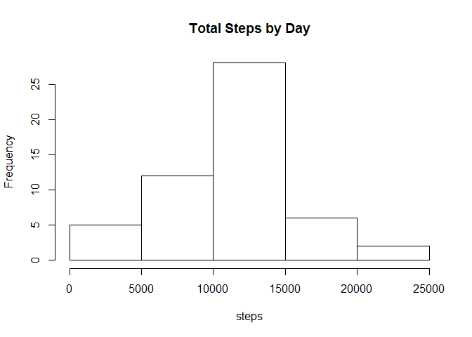

# Reproducible Research: Peer Assessment 1


## Loading and preprocessing the data


```r
unzip("activity.zip", overwrite = T, unzip="internal")

activity<-read.csv("~/datasciencecourserarepo/reproducible/RepData_PeerAssessment1/activity.csv", header=TRUE)

activity$day <- weekdays(as.Date(activity$date))                 
activity$DateTime<- as.POSIXct(activity$date, format="%Y-%m-%d") 
```

## What is mean total number of steps taken per day?

Sum data by date

```r
steps_by_day <- aggregate(steps ~ date, activity, sum)
```

Create histogram

```r
hist(steps_by_day$steps, breaks=5,main="Total Steps by Day", xlab="steps")
```


Calculate mean and median

```r
as.integer(mean(steps_by_day$steps))
```

```
## [1] 10766
```

```r
as.integer(median(steps_by_day$steps))
```

```
## [1] 10765
```
## What is the average daily activity pattern?

```r
steps_by_interval <- aggregate(steps ~ interval, activity, mean)


plot(steps_by_interval$interval,steps_by_interval$steps, 
     type="l", xlab="Interval", ylab="Number of Steps",
     main="Average Number of Steps per Day by Interval")
```


## Imputing missing values

```r
incomplete <- sum(!complete.cases(activity))


imputed_data <- transform(activity, 
                          steps = ifelse(is.na(activity$steps), 
                          steps_by_interval$steps[match(activity$interval, 
                          steps_by_interval$interval)], activity$steps))

imputed_data[as.character(imputed_data$date) == "2012-10-01", 1] <- 0
```
Create histogram

```r
steps_by_day_i <- aggregate(steps ~ date, imputed_data, sum)
hist(steps_by_day_i$steps, main = paste("Total Steps Each Day"), col="blue", xlab="Number of Steps")

hist(steps_by_day$steps, main = paste("Total Steps Each Day"), col="red", xlab="Number of Steps", add=T)
legend("topright", c("Imputed", "Non-imputed"), col=c("blue", "red"), lwd=10)
```


What is the diff between imputted and non imputted data

```r
diff <- sum(steps_by_day_i$steps) - sum(steps_by_day$steps)
as.integer(diff)
```

```
## [1] 75363
```

## Are there differences in activity patterns between weekdays and weekends?

```r
weekdays <- c("Monday", "Tuesday", "Wednesday", "Thursday", 
              "Friday")
imputed_data$dow = as.factor(ifelse(is.element(weekdays(as.Date(imputed_data$date)),weekdays), "Weekday", "Weekend"))

steps_by_interval_i <- aggregate(steps ~ interval + dow, imputed_data, mean)

library(lattice)

xyplot(steps_by_interval_i$steps ~ steps_by_interval_i$interval|steps_by_interval_i$dow, main="Average Steps per Day by Interval",xlab="Interval", ylab="Steps",layout=c(1,2), type="l")
```


